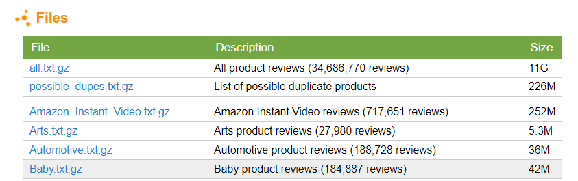

# Pipeline Descarga y Carga de datos

En esta sección, se da a conocer el método aplicado para guardar los datasets iniciales en la base de datos seleccionada. En este caso utilizaremos los servicios de Google Cloud Storage, los cuales nos permiten guardar información (datasets) en contenedores denominados buckets.

> 0. Los datos originales

Como es de conocimiento, los datasets originales estan guardados en la página oficial de [Stanford Network Analysis Project](http://snap.stanford.edu/data/web-Amazon.html), los cuales están comprimidos y guardados en formato .json.

> 1. Descarga de datos

