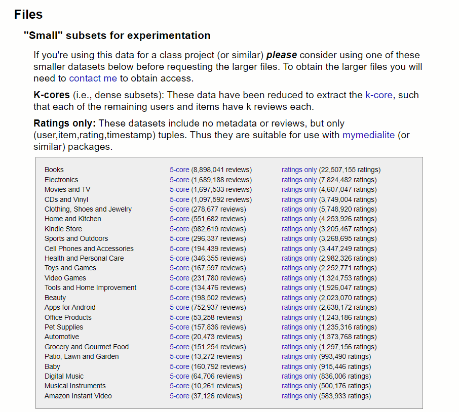
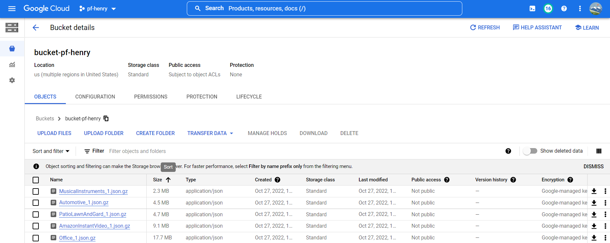

# Pipeline: Download and Upload data

In this section, the method applied to save the initial datasets in the selected database is disclosed. In this case we will use Google Cloud Storage services, which allow us to store information (datasets) in containers called buckets.
<hr>

## 0. The original datasets

The original datasets are saved on the official page of [Stanford Network Analysis Project](http://jmcauley.ucsd.edu/data/amazon/links.html), which are compressed and saved in .json format.


<hr>

## 1. Datasets download

Downloading data is done by iterating the following function:

```python
response = requests.get(URL) # URL of dataset
    open("./ExampleDownload.json.gz", "wb").write(response.content)
```

Once downloaded the files will automatically appear in the Downloads folder <b>./src/Datasets/Downloads</b>.


<hr>

## 2. Chunk of datasets

Once the original files have been downloaded and saved, each one is fragmented into subfiles of 500,000 rows, using the .csv format.

To do this, iterate the function:

```python
h.getChunkDF('./Datasets/Downloads/',onlyfiles[i],500000,type = '.csv')
```

Getting at the end subfiles in the CSVs folder <b>./src/Datasets/CSVs</b>.: 


<hr>

## 3. Basic Transformation to Fragments

The fragments are passed through a transformation stage, which consists of filling cells with null values ​​and separating the <b>helpfull</b> column into <b>UsefulReviews</b> and <b>TotalReviews columns</b>.

This is done by iterating the following functions:<br>
```python
# Replacing Nulls
df = h.ReplaceNulls('./Datasets/CSVs/','Example.csv')

# Spliting helpful and Creating Date Column
df = h.helpfulAndDate('./Datasets/ETL/','Example.csv')
```
Original Data:<br>


Transformated Data:<br>

<hr>

## 4. Data Compression

Once the appropriate transformation has been carried out on each fragment, theese are compressed so that our backup is faster to upload to the cloud server.

To compress the files, iterate the following function:

```python
df = pd.read_csv('./Datasets/ETL/{}'.format(onlyfiles[i]))
        df.to_json('./Datasets/Compressed_Files/{}'.format(onlyfiles[i]).replace('.csv','.json.gz'),orient='records',lines=True,compression="gzip")
```
These compressed files will be saved in the path <b>./src/Datasets/Compressed_Files</b>.


<hr>

## 5. Uploading Fragments to Google Cloud Storage

The chunked files are uploaded to a specific bucket dedicated to this project, called [bucket-pf-henry]().

To load the processed files, the following function is iterated:

```python
h.upload_to_bucket(onlyfiles[i],'./Datasets/ETL/ExampleFile.csv','bucket-pf-henry')
```

This is how we upload our processed files to the cloud, using Google Cloud Storage services. In order to be able to have a periodic backup of all the data received.


